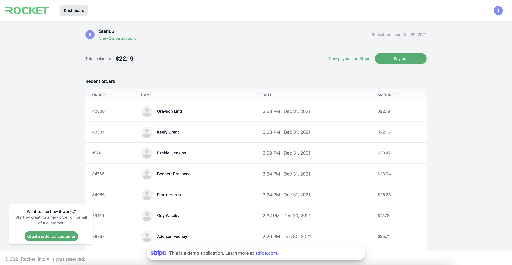

# Rocket: Stripe Global Payments Demo

Rocket - is a demo of accepting B2C flow with Stripe for food delivery companies. These companies are often not technology companies and Rocket helps these platforms to help streamline the accepting payments, orders creating and making payouts for food deliverers.

## Overview



Rocket has the following features, Stripe s, and Stripe integrations:

<!-- prettier-ignore -->
|     |Features
:---: | :---

## Running locally

If you want to run this demo locally against a different Stripe account, follow the instructions below:

### Requirements

- You'll need a Stripe account. [Sign up for free](https://dashboard.stripe.com/register) before running the application.
- Node.js >= 14.7.0

### Getting Started

Clone the repo and install dependencies using npm (or yarn):

```
$ git clone ...
$ cd Rocket
$ npm install
```

If this is your first time running the app, you'll need to setup Stripe Connect and branding on your Stripe account:

1. Make sure Stripe Connect is enabled in the [dashboard](https://dashboard.stripe.com/test/connect/accounts/overview)
2. Set up Express Accounts and make sure **Transfers** and **Payments** are enabled in [express setup](https://dashboard.stripe.com/test/settings/connect/express)
3. Set up Rocket Brading in [settings](https://dashboard.stripe.com/test/settings/connect):
   - Use `Rocket` as the **business name**
   - Upload [Rocket logo](./public/images/branding-logo.png) to the **Icon**
   - Set `#F3F4F6` to the **Brand colour**
   - Set `#2BA166` to the **Accent colour**

Copy the example .env file. You'll need to define the following env variables:

- Your [Stripe API keys](https://dashboard.stripe.com/account/apikeys) to `STRIPE_SECRET_KEY` and `STRIPE_PUBLISHABLE_KEY`
- A random string to keep user authentication secure to `SESSION_SECRET_KEY`

```
$ cp .env.example .env
```

Run the app:

```
$ npm run dev
```

Go to [http://localhost:4567](http://localhost:4567) in your browser to start using Rocket.

